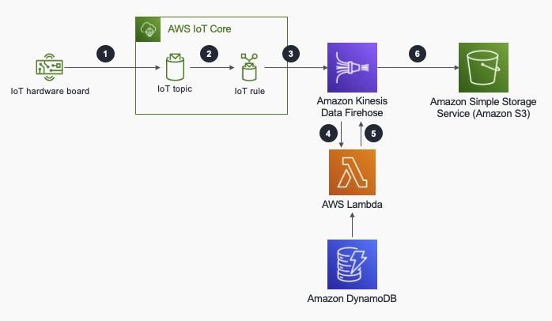

## Ingesting enriched IoT data into Amazon S3 using Amazon Kinesis Data Firehose

When sending data from Internet of Things (IoT) devices to a data lake, you may need to enrich the device data payload with additional metadata in the cloud for further data processing and visualization. There are multiple reasons this data might not exist in the device payload, such as minimizing the device payload in limited bandwidth environments or modifying it with business inputs in the cloud. For example, a machine on the factory floor might be assigned to different operators during the day. This variable business data would be stored in a database. In your data lake, you might need this information to be stored along with the payload.

In this repository, you can find a sample CloudFormation template which creates all the necessary resources for ingesting IoT device data into an Amazon S3 bucket after enriched and batched by Amazon Kinesis Data Firehose.

For more information read the [blog post](https://aws.amazon.com/blogs/iot/ingesting-enriched-iot-data-into-amazon-s3-using-amazon-kinesis-data-firehose/).

## Table of content

- [Architecture](#architecture)
- [Prerequisites](#prerequisites)
- [Deployment](#deployment)
- [Testing](#testing)
- [Troubleshooting](#troubleshooting)
- [Clean Up](#clean-up)
- [License](#license)

## Architecture

An overview of the architecture can be seen below

In the architecture diagram, 
1.	The IoT devices stream payloads to the AWS IoT Core message broker to a specific MQTT topic device/data/DEVICE_ID. The AWS IoT Core message broker allows devices to publish and subscribe to messages by using supported protocols.
2.	The AWS IoT rule is triggered when there is a payload in its topic. It is configured with an Amazon Kinesis Data Firehose action in this use case. You can use AWS IoT rules to interact with AWS services by calling them when there is a message in a specific MQTT topic or directly by using Basic Ingest feature.
3.	Amazon Kinesis Data Firehose buffers the device payloads before delivering them to the data store based on the size or the time, whichever happens first. Kinesis Data Firehose delivers real-time streaming data to destinations for storing or processing.
4.	Once the buffer hits the size or the time threshold, Kinesis Data Firehose calls an AWS Lambda function to enrich the device payloads in batches with the metadata retrieved from an Amazon DynamoDB table. AWS Lambda is a serverless compute service that runs your code for any type of application. Amazon DynamoDB is a fully managed NoSQL database that provides fast performance.
5.	The enriched payloads are returned back to Kinesis Data Firehose to deliver to the destination.
6.	The enriched payloads are put into an Amazon Simple Storage Service (Amazon S3) bucket as a destination. Amazon S3 is an object storage service which stores any amount of data for a range of use cases.

## Prerequisites

1. An AWS account
2. AWS Command Line Interface (AWS CLI). See AWS CLI [quick setup](https://docs.aws.amazon.com/cli/latest/userguide/getting-started-quickstart.html) for configuration.

## Deployment

Run the following command in a terminal to deploy the stack.

`aws cloudformation deploy --stack-name IoTKinesisDataPath  --template-file IoTKinesisDataPath.yml --parameter-overrides  IotKinesisRuleSQL="SELECT *, topic(3) as containerId FROM 'device/data/+'" --capabilities CAPABILITY_NAMED_IAM`

After the deployment is complete, run the following command in a terminal to see the output of the deployment.

`aws cloudformation describe-stacks --stack-name IoTKinesisDataPath`

Note the IoTLogS3BucketName, MetadataTableName output parameters. 

## Testing

After the deployment is complete, first thing you need to do is to create a metadata item for data enrichment. Run the following command to create an item in the DynamoDB table. It will create an item with cont1 as containerId and ship1 as shipId. Replace IoTKinesisDataPath-MetadataTable-SAMPLE parameter with the DynamoDB table output parameter from the CloudFormation stack deployment.

`aws dynamodb put-item --table-name IoTKinesisDataPath-MetadataTable-SAMPLE --item '{"containerId":{"S":"cont1"},"shipId":{"S":"ship1"}}'`

In a real-life scenario, the devices publish the payloads to a specific MQTT topic. In this example, instead of creating IoT devices, you will use AWS CLI to publish payloads to MQTT topics. Run the following command in a terminal to publish a sample data payload AWS IoT Core. Pay attention to the payload field of the command, the only data provided by the device is the dynamic data.

`aws iot-data publish --topic "device/data/cont1" --payload '{"temperature":20,"humidity":80,"latitude":0,"longitude":0}' --cli-binary-format raw-in-base64-out`

Now, navigate to Amazon S3 from the AWS Management Console and select the bucket that has been created with the CloudFormation stack. You should see the device-data folder in this bucket. It may take up to 1 minute for the data to appear due to the buffering configuration that is set for the Firehose delivery stream. If you navigate into the device-data/YYYY/MM/dd/HH folder, you will see an object has been created. Go ahead and open this file. You will see the content of the file is the data payload with enriched shipId field. 
{"temperature": 20, "humidity": 80, "latitude": 0, "longitude": 0, "containerId": "cont1", "shipId": "ship1"}

## Troubleshooting

In case of failure in the system, the following resources can be useful for analyzing the source of the problem.

To monitor AWS IoT Core rules engine, you need to enable AWS IoT Core logging. This will give detailed information about the events happening in AWS IoT Core.

AWS Lambda can be monitored by using Amazon CloudWatch. The example CloudFormation template has necessary permissions to create a log group for the Lambda function logging.

In case of failure, Kinesis Data Firehose will create a processing-failed folder under the device-data prefix in the AWS IoT rules engine action, transform Lambda function or Amazon S3 bucket. The details of the failure can be read as json objects. You can find more information in this documentation.

## Clean up

To clean up the resources that have been created, first empty the Amazon S3 bucket. Run the following command by changing the bucket-name parameter with the name of the bucket deployed by the CloudFormation stack. Important: this command will delete all the data inside the bucket irreversibly. 

`aws s3 rm s3://bucket-name --recursive`

Then, you can delete the CloudFormation stack by running the following command in a terminal.

`aws cloudformation delete-stack --stack-name IoTKinesisDataPath`

## Security

See [CONTRIBUTING](CONTRIBUTING.md#security-issue-notifications) for more information.

## License

This library is licensed under the MIT-0 License. See the LICENSE file.

